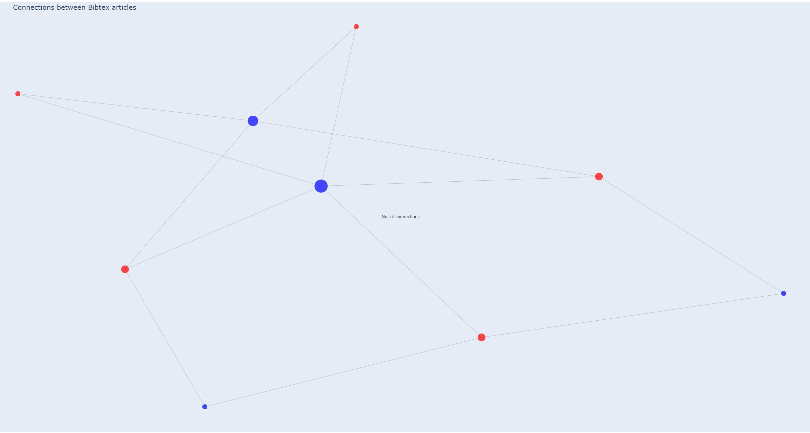
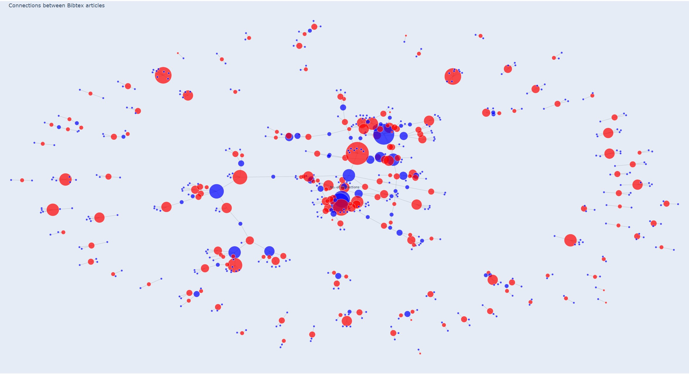

# Connections between Articles in BibTeX Databases
## Author: [Mr Dafydd Weightman](https://github.com/DAW31/)
### Supervisor: [Dr Franck Vidal](https://github.com/effepivi/)

## Objectives

[Bangor University](https://www.bangor.ac.uk/) Final year project for Computer Information Systems BSc (Hons)
Implemented using Python

<table>
    <tr>
        <td valign="top"></td>
        <td valign="middle">Coded in python and viewed in a browser</td>
    </tr>
  <tr>
        <td valign="top"></td>
        <td valign="middle">a Network visualization of viewing connections between Authors and titles in BibTeX databases.  </td>
    </tr>
  <tr>
        <td valign="top"></td>
        <td valign="middle">Interactive experience of the visualization.</td>
    </tr>
  <tr>
        <td valign="top"></td>
        <td valign="middle">Easily distinguishable authors and titles and the connections between them.</td>
    </tr>
</table>

## Usage

### BibParse.py
python BibParse.py bibtex_file_1.bib bibtex_file_2.bib ... bibtex_file_N.bib

This should then create db.json

### BibParse.py
python BibViz.py

## Results
Visualization example using test data (TEST.bib)

Visualization example using real data.

